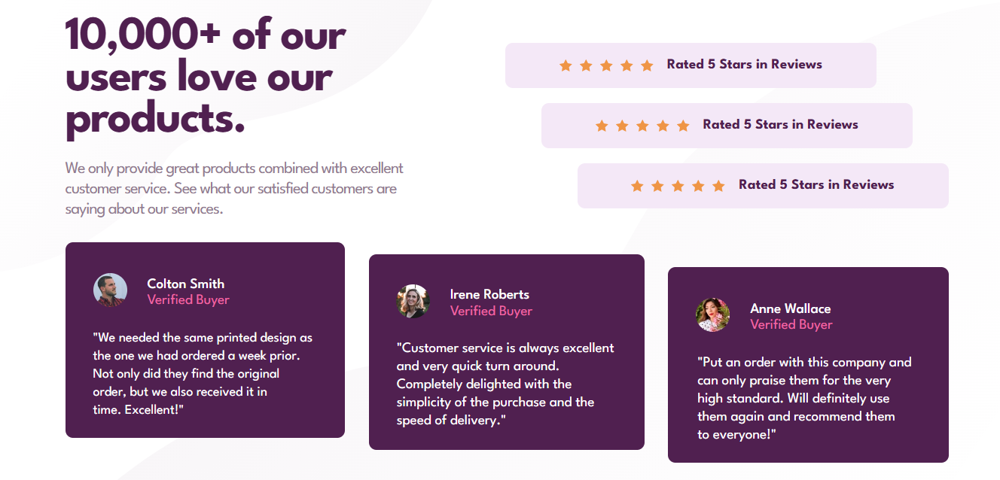
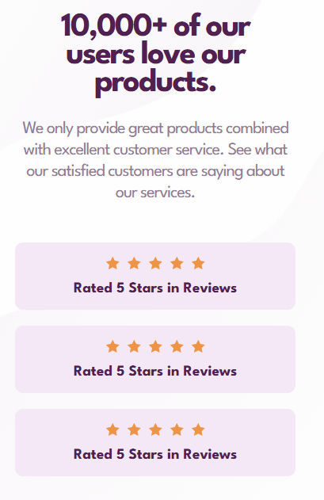

# Frontend Mentor - Social proof section solution

Esta é uma solução para o [Desafio da seção de prova social no Frontend Mentor](https://www.frontendmentor.io/challenges/recipe-page-KiTsR8QQKm). Os desafios do Frontend Mentor ajudam você a melhorar suas habilidades de codificação construindo projetos realistas.


### Screenshot

[]

[]


### Link


- URL do site ativo: [link aqui](https://andersonf-dev.github.io/3-column-preview-card-component/)


### Criado com

- Marcação HTML5 semântica
- Propriedades personalizadas CSS
- grid-template-areas


### O que aprendi

Foi um bom projeto para treinar grid-template-areas

```css
.section-information{grid-area: section-information;}
.conteiner-comment{grid-area:  conteiner-comment;}


.grid-conteiner {
    display: grid;
    grid-template-areas:
     "section-information section-information section-information"
     "conteiner-comment conteiner-comment conteiner-comment";

    grid-template-columns: repeat(3, 1fr);
    grid-template-rows: 1fr 1fr 1fr;

    
    max-width: 1233px;
    max-height: 596px;
    
}

.grid-conteiner .section-information {
    display: flex;
}

```

### Desenvolvimento contínuo

Este é apenas o decimo primeiro de muitos dos projetos de front end que fiz. Continuarei fazendo e me desenvolvendo ainda mais. Estou aprendendo cada dia mais, fazendo esses desafios, 
